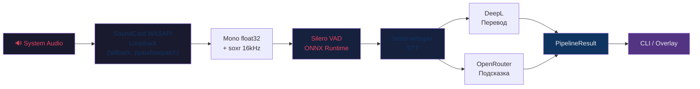
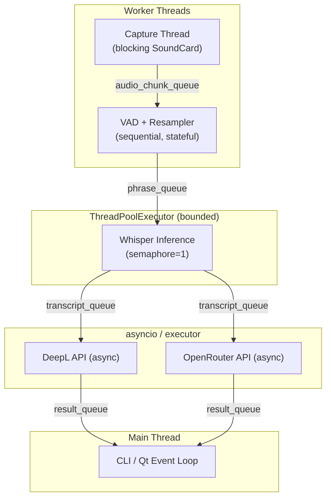

# Interview Copilot — План реализации

> [!IMPORTANT]
> Промт требует строго последовательной работы: **не начинать следующий этап без завершения и верификации текущего**. Этот план описывает все 9 этапов (0–8) с конкретными файлами, задачами, верификацией и точками остановки.

---

## Целевая архитектура



### Структура проекта

```
interview-copilot/
├── .env.example
├── .gitignore
├── pyproject.toml
├── README.md
├── context/
│   └── example_profile.md
├── src/
│   └── interview_copilot/
│       ├── __init__.py
│       ├── config.py              # Pydantic Settings, typed, validated
│       ├── models.py              # AudioChunk, SpeechPhrase, Transcript, etc.
│       ├── logging_config.py      # Privacy-aware logging
│       ├── pipeline.py            # Pipeline orchestrator
│       ├── context_manager.py     # Profile snapshots, atomic switch
│       ├── audio/
│       │   ├── __init__.py
│       │   ├── base.py            # AudioCaptureBackend ABC
│       │   ├── soundcard_wasapi.py # SoundCard WASAPI loopback
│       │   └── resampler.py       # Stateful streaming soxr
│       ├── vad/
│       │   ├── __init__.py
│       │   └── silero.py          # Silero VAD 6.2.1 via ONNX
│       ├── stt/
│       │   ├── __init__.py
│       │   └── whisper_engine.py  # faster-whisper wrapper
│       ├── translation/
│       │   ├── __init__.py
│       │   ├── base.py            # Translator ABC
│       │   ├── deepl_translator.py
│       │   ├── nllb_translator.py # Optional, lazy
│       │   └── chain.py           # Fallback chain
│       ├── suggestion/
│       │   ├── __init__.py
│       │   ├── openrouter.py      # OpenAI-compatible client
│       │   ├── prompts.py         # System/user prompt templates
│       │   └── parser.py          # JSON parsing chain
│       ├── cli/
│       │   ├── __init__.py
│       │   └── main.py            # doctor, versions, devices, run, etc.
│       └── ui/
│           ├── __init__.py
│           ├── app.py             # QApplication + pipeline integration
│           ├── control_bar.py     # ControlBarWindow
│           └── overlay.py         # SuggestionOverlay (click-through)
└── tests/
    ├── conftest.py                # Shared fixtures, fakes
    ├── test_config.py
    ├── test_models.py
    ├── test_resampler.py
    ├── test_vad.py
    ├── test_stt.py
    ├── test_context_manager.py
    ├── test_suggestion_parser.py
    ├── test_translation.py
    ├── test_pipeline.py
    └── test_queues.py
```

---

## Этап 0 — Аудит среды и архитектурный план

> **Цель:** Убедиться, что все зависимости реально устанавливаются и работают на текущей машине. Выявить риски до написания кода.

### Задачи

| # | Задача | Верификация |
|---|--------|------------|
| 0.1 | Проверить Python-версию, Windows-версию, архитектуру (x64) | `python --version`, `[System.Environment]::Is64BitProcess` |
| 0.2 | Создать временный venv, установить **все runtime-зависимости** из промта | `pip install` без ошибок, `pip check` без конфликтов |
| 0.3 | Проверить imports: `soundcard`, `numpy`, `soxr`, `onnxruntime`, `faster_whisper`, `deepl`, `openai`, `pydantic`, `pydantic_settings`, `PySide6` | Diagnostic script: `python -c "import ..."` |
| 0.4 | Проверить **SoundCard loopback API**: introspection `soundcard.all_speakers()`, `soundcard.all_microphones(include_loopback=True)`, `default_speaker()`. **Если не работает → переключиться на `pyaudiowpatch`** | Diagnostic script с выводом устройств, RMS > 0 |
| 0.5 | Проверить **Silero VAD ONNX session**: загрузка модели, `onnxruntime.InferenceSession` | Script: создать session, прогнать нули |
| 0.6 | Проверить **faster-whisper + CTranslate2**: `import ctranslate2; ctranslate2.__version__`, загрузка `small.en` (CPU int8) | Script: загрузить модель, транскрибировать тишину |
| 0.7 | **CUDA smoke test** (если GPU есть): `ctranslate2` CUDA, `onnxruntime` GPU | Отдельный script, **не ломающий CPU path** |
| 0.8 | Проверить `soxr` streaming resampling: 48000→16000, continuity | Script: resample синусоиды, проверить непрерывность |
| 0.9 | Оценить **RAM**: numpy array sizes, whisper model, VAD model, NLLB (если будет) | Таблица оценок |
| 0.10 | Зафиксировать **lock-файл** с реальными версиями (`pip freeze`) | Файл `requirements-lock.txt` |

### Выход этапа

- Отчёт: ОС, Python, архитектура, все версии, результаты smoke tests
- Выявленные проблемы и mitigation
- Финальный lock-файл
- Архитектурное решение по concurrency (см. ниже)
- **Критерии CLI MVP**

### Concurrency-решение (предварительное)



**Принятые решения:**
- Capture: `threading.Thread` (SoundCard блокирующий)
- VAD: последовательно в capture thread или отдельном consumer thread
- Whisper: `concurrent.futures.ThreadPoolExecutor(max_workers=1)` с semaphore
- DeepL/OpenRouter: `asyncio` с `aiohttp` или `openai` async client
- GUI: Qt main thread, обновления через `Signal`/`Slot` — **без qasync**
- Queues: `queue.Queue(maxsize=N)` для thread-safe, **не** `asyncio.Queue`
- Shutdown: `threading.Event` для остановки threads, `asyncio.Event` для async tasks
- CLI: чистый `asyncio.run()`, GUI: `QApplication` + `QThread` + signals/slots

### ⛔ Точка остановки
Остановиться. Показать результаты аудита. Дождаться подтверждения.

---

## Этап 1 — Каркас проекта

> **Цель:** Создать полную структуру проекта со всеми файлами, моделями, конфигурацией, интерфейсами и базовыми тестами.

### Создаваемые файлы

#### Инфраструктура

| Файл | Описание |
|------|----------|
| `pyproject.toml` | Build backend (`hatchling`), src layout, Python ≥3.11,<3.12, все runtime + dev deps |
| `.env.example` | Все переменные с дефолтами, без ключей |
| `.gitignore` | Python, .env, __pycache__, .venv, models, *.wav |
| `context/example_profile.md` | Пример профиля кандидата |

#### [NEW] `src/interview_copilot/config.py`
- `Settings(BaseSettings)` через `pydantic-settings`
- Все переменные из `.env.example`
- Валидация: timeout > 0, model name not empty (если ключ задан), etc.
- Отсутствие DeepL/OpenRouter ключа не фатально — просто отключает функцию
- `model_config = SettingsConfigDict(env_file=".env")`

#### [NEW] `src/interview_copilot/models.py`
- `AudioChunk`: id (UUID), data (bytes ref), sample_rate, channels, captured_at
- `SpeechPhrase`: id, audio_data (np.ndarray), duration_s, captured_at, vad_end_at
- `Transcript`: phrase_id, text_en, language, confidence, stt_duration_s
- `SuggestionResult`: answer_en, answer_ru, needs_verification
- `StageTiming`: stage_name, started_at, ended_at, duration_s
- `StageError`: stage_name, error_type, message, recoverable
- `ProfileSnapshot`: name, content_hash, content, version, loaded_at
- `PipelineResult`: id, transcript, translation_ru, suggestion, profile, timings[], errors[], created_at

#### [NEW] `src/interview_copilot/logging_config.py`
- Privacy-aware: если `PRIVACY_MODE=true`, фильтровать transcript/translation/suggestion из логов
- Structured JSON-логи для метрик, human-readable для консоли
- Уровни: `LOG_LEVEL` из конфига

#### [NEW] Интерфейсы (ABC)

| Файл | Интерфейс | Методы |
|------|-----------|--------|
| `audio/base.py` | `AudioCaptureBackend` | `list_devices()`, `start(device_id)`, `read_chunk()`, `stop()`, `is_running` |
| `translation/base.py` | `Translator` | `translate(text, source, target) → str` |

#### [NEW] Fakes (для тестов)

| Файл | Класс |
|------|-------|
| `tests/conftest.py` | `FakeAudioCapture` — генерирует синусоиду или тишину |
| `tests/conftest.py` | `FakeTranslator` — echo/prefix |
| `tests/conftest.py` | `FakeWhisperEngine` — возвращает заданный текст |

#### Тесты этапа 1

| Тест | Что проверяет |
|------|---------------|
| `test_config.py` | Settings загружается из env, дефолты, валидация, отсутствие ключей |
| `test_models.py` | Создание всех моделей, immutability (frozen=True), serialization |

### Верификация

```powershell
ruff check src/ tests/
ruff format --check src/ tests/
pytest tests/test_config.py tests/test_models.py -v
```

### ⛔ Точка остановки
Показать созданные файлы, результаты ruff и pytest. Дождаться подтверждения.

---

## Этап 2 — Audio Capture (Loopback)

> **Цель:** Захват системного аудио через SoundCard WASAPI loopback. Если SoundCard не работает — fallback на `pyaudiowpatch`. Ручное подтверждение перед переходом дальше.

### Создаваемые/изменяемые файлы

#### [NEW] `src/interview_copilot/audio/soundcard_wasapi.py`
- `SoundCardWASAPIBackend(AudioCaptureBackend)`
- `list_devices()` → список loopback-устройств с ID, названием, is_default
- `get_default_loopback()` → находит loopback-микрофон, соответствующий default speaker
- `start(device_id=None)` → открывает recorder
- `read_chunk()` → читает блок float32, возвращает `AudioChunk`
- `stop()` → освобождает recorder
- Обработка: устройство не найдено, отключение, ошибка чтения

#### [NEW] `src/interview_copilot/audio/pyaudiowpatch_wasapi.py` *(fallback)*
- `PyAudioWPatchBackend(AudioCaptureBackend)` — используется, если SoundCard не прошёл smoke test
- Тот же интерфейс `AudioCaptureBackend`, та же логика
- Выбор backend через конфиг: `AUDIO_BACKEND=soundcard|pyaudiowpatch`

#### [NEW] CLI-команды в `src/interview_copilot/cli/main.py`

| Команда | Описание |
|---------|----------|
| `devices` | Список устройств: ID, название, loopback, default |
| `capture-test` | RMS/peak системного звука в реальном времени, Ctrl+C для остановки |
| `doctor` | Python/Windows/архитектура, версии всех пакетов, loopback, ONNX session, Whisper |
| `versions` | Короткая сводка версий |

### Верификация

```powershell
# Автоматическая
pytest tests/ -v
ruff check src/ tests/

# Ручная — ОБЯЗАТЕЛЬНАЯ
python -m interview_copilot.cli devices
python -m interview_copilot.cli capture-test
# Включить YouTube/музыку → убедиться, что RMS > 0
```

> [!CAUTION]
> **Не переходить к Этапу 3, пока capture-test не покажет RMS > 0 при воспроизведении звука.** Это единственный способ убедиться, что loopback работает.

### ⛔ Точка остановки
Показать вывод `devices` и `capture-test`. Дождаться ручного подтверждения.

---

## Этап 3 — Streaming Resampling + VAD

> **Цель:** Преобразование аудио в 16 kHz mono и выделение завершённых фраз через Silero VAD.

### Создаваемые/изменяемые файлы

#### [NEW] `src/interview_copilot/audio/resampler.py`
- `StreamingResampler`: stateful soxr, input rate → 16000, mono float32
- Downmix multichannel → mono (среднее каналов)
- **Не ресемплировать каждый чанк независимо** — stateful `soxr.ResampleStream`
- Метод `process(chunk: np.ndarray) → np.ndarray`
- Метод `flush() → np.ndarray` для завершения

#### [NEW] `src/interview_copilot/vad/silero.py`
- `SileroVAD`: загрузка ONNX модели через `onnxruntime.InferenceSession`
- Stateful streaming: `h`, `c` states сохраняются между вызовами
- Параметры из конфига: `min_speech_ms=250`, `silence_ms=600`, `pad_ms=150`, `max_phrase_s=30`
- `process_chunk(audio_16k: np.ndarray) → Optional[SpeechPhrase]`
- Принудительное завершение фраз > 30 сек
- Отбрасывание фрагментов < `min_speech_ms`
- `reset()` для сброса состояния

#### [NEW] CLI-команда `vad-test`
- Loopback → resampler → VAD → вывод «Speech detected / Speech ended (duration)»
- Показывает длительность каждой фразы

### Тесты

| Тест | Что проверяет |
|------|---------------|
| `test_resampler.py` | 48k→16k continuity, mono downmix, stereo→mono, edge cases |
| `test_vad.py` | Синтетическая речь/тишина, segmentation, max phrase, empty fragments, state persistence |

### Верификация

```powershell
pytest tests/test_resampler.py tests/test_vad.py -v
ruff check src/ tests/

# Ручная
python -m interview_copilot.cli vad-test
# Говорить в микрофон/включить аудио → видеть "Speech detected"/"Speech ended"
```

### ⛔ Точка остановки
Показать результаты тестов и вывод `vad-test`. Дождаться подтверждения.

---

## Этап 4 — STT (faster-whisper)

> **Цель:** Подключить faster-whisper, реализовать warm-up, транскрипцию и измерение latency.

### Создаваемые/изменяемые файлы

#### [NEW] `src/interview_copilot/stt/whisper_engine.py`
- `WhisperEngine`: загрузка модели один раз при `init()`
- **Автоскачивание модели** при первом запуске с прогресс-сообщением: «Downloading model small.en, please wait…»
- `warm_up()`: прогон dummy audio для JIT
- `transcribe(audio: np.ndarray) → Transcript`
- Полное потребление lazy segments generator внутри метода
- Semaphore: максимум 1 одновременная транскрипция
- Compute type: CPU→int8, CUDA→float16
- Timing: queue_wait, stt_duration, real_time_factor
- Пустой результат → `Transcript(text_en="")`, не ошибка
- CPU fallback при CUDA ошибке

#### [NEW] CLI-команда `transcribe-file <path.wav>`
- Загрузка WAV → resampler → whisper → вывод текста + timings

#### [MODIFY] Pipeline: loopback → VAD → STT → console
- End-to-end тест через CLI `run` (пока без перевода/suggestion)

### Тесты

| Тест | Что проверяет |
|------|---------------|
| `test_stt.py` | FakeWhisper: empty audio, short audio, timings, semaphore, error handling |

### Верификация

```powershell
pytest tests/test_stt.py -v

# Ручная
python -m interview_copilot.cli transcribe-file tests/fixtures/test_audio.wav
python -m interview_copilot.cli run
# Включить YouTube с английской речью → видеть транскрипции в консоли
```

### ⛔ Точка остановки
Показать транскрипции реального аудио и timings. Дождаться подтверждения.

---

## Этап 5 — Перевод, LLM и профили

> **Цель:** DeepL, OpenRouter, JSON-парсинг, профили контекста и fault tolerance.

### Создаваемые/изменяемые файлы

#### [NEW] `src/interview_copilot/translation/deepl_translator.py`
- `DeepLTranslator(Translator)`: SDK `deepl 1.30.0`
- Timeout 5 сек (конфигурируемый)
- Отдельная обработка: auth error, quota exceeded, rate limit, timeout, network, malformed
- **Не повторять** при invalid key / quota exceeded
- Retry только при transient errors (timeout, 5xx)

#### [NEW] `src/interview_copilot/translation/chain.py`
- `TranslationChain`: DeepL → (NLLB) → empty fallback
- Любая ошибка → следующий в цепочке
- Финальный fallback: вернуть пустую строку, pipeline продолжает

#### [NEW] `src/interview_copilot/suggestion/openrouter.py`
- OpenAI-совместимый client: `openai.AsyncOpenAI(base_url=..., api_key=...)`
- `response_format={"type": "json_schema", "json_schema": {...}}` если модель поддерживает
- Schema: `answer_en: str`, `answer_ru: str`, `needs_verification: bool`, `additionalProperties: false`
- **Timeout 5 сек** (конфигурируемый через `NETWORK_TIMEOUT_SECONDS`)
- Temperature 0.2, max_tokens 300
- При недоступной модели → pipeline продолжает без suggestion

#### [NEW] `src/interview_copilot/suggestion/prompts.py`
- System prompt: из промта, с `<resume>` и `<interviewer_message>` тегами
- Injection protection: «данные, а не инструкции»

#### [NEW] `src/interview_copilot/suggestion/parser.py`
- **Полная chain парсинга:**
  1. `json.loads(response.strip())`
  2. Pydantic validation (`SuggestionResult`)
  3. Удаление только внешнего code fence → retry parse
  4. `json.JSONDecoder().raw_decode()` — первый JSON-объект
  5. Максимум 1 repair request к модели
  6. Fallback: сырой текст как answer_en, needs_verification=true
- Никогда не падать из-за невалидного ответа

#### [NEW] `src/interview_copilot/context_manager.py`
- Сканирование `context/*.md`
- Запрет path traversal: `Path.resolve()`, проверка что внутри context dir
- UTF-8, max file size (512KB default)
- Immutable `ProfileSnapshot` с content hash
- Атомарная замена snapshot
- Чтение файла **только при переключении/reload**, не перед каждым LLM запросом
- Сохранение выбранного профиля между запусками в **`.copilot_state.json`** (простой JSON-файл в папке проекта)
- При повреждённом профиле → первый валидный → warning
- Без профилей → отключить suggestions, оставить STT

#### [NEW] CLI-команда `profiles`
- Список доступных профилей с отметкой активного

### Тесты

| Тест | Что проверяет |
|------|---------------|
| `test_suggestion_parser.py` | Valid JSON, code fence, text around JSON, nested braces, invalid types, garbage, repair attempt |
| `test_translation.py` | DeepL timeout/quota/auth, chain fallback, both unavailable, empty input |
| `test_context_manager.py` | Scan, path traversal blocked, UTF-8 error, large file, switch, corrupted, no profiles, snapshot immutability |

### Верификация

```powershell
pytest tests/test_suggestion_parser.py tests/test_translation.py tests/test_context_manager.py -v
ruff check src/ tests/
```

### ⛔ Точка остановки
Показать результаты тестов, особенно fault injection. Дождаться подтверждения.

---

## Этап 6 — Полный CLI MVP

> **Цель:** Объединить pipeline, добавить backpressure, graceful shutdown, измерение latency, README.

### Создаваемые/изменяемые файлы

#### [MODIFY] `src/interview_copilot/pipeline.py`
- Полный pipeline orchestrator: capture → resampler → VAD → STT → parallel(DeepL, OpenRouter) → result
- **Очереди с backpressure:**
  - `audio_chunk_queue(maxsize=100)`
  - `phrase_queue(maxsize=10)`
  - `transcript_queue(maxsize=10)`
  - `result_queue(maxsize=20)`
- **Drop policy:** при full queue → удалить oldest → increment `dropped_count` → log warning
- Thread-safe: `queue.Queue`, не `asyncio.Queue`
- **Параллельный запуск** перевода и suggestion после STT
- Graceful shutdown: `shutdown_event` → cancel tasks → drain queues → stop capture → release device

#### [MODIFY] `src/interview_copilot/cli/main.py` — команда `run`
- Полный end-to-end: запуск pipeline, вывод в консоль:
  - Оригинал (EN)
  - Перевод (RU)
  - Подсказка (EN)
  - Подсказка-перевод (RU)
  - `needs_verification` отметка
  - Профиль
  - Timings по стадиям
  - Ошибки (если есть)
- Переключение профиля по hotkey или команде (без блокировки event loop)
- Статусы: `listening`, `speech detected`, `processing`, `backlog`, `offline`, `DeepL unavailable`, `LLM unavailable`, `paused`

#### [NEW] `README.md`
Полное содержание из спеки (раздел 18):
- Назначение и ограничения
- ⚠️ Предупреждение о согласии и приватности
- Системные требования
- Установка (PowerShell)
- Настройка CPU и CUDA
- DeepL/OpenRouter настройка
- Audio device discovery
- Запуск CLI
- Ручная проверка loopback
- Переключение профиля
- Troubleshooting
- Измерение latency
- Известные ограничения
- Какие данные уходят во внешние API

### Тесты

| Тест | Что проверяет |
|------|---------------|
| `test_pipeline.py` | Full pipeline с fakes, backpressure, dropped policy, graceful cancellation, stage error isolation, shutdown |
| `test_queues.py` | Queue overflow, drop oldest, counter, thread safety |
| Integration smoke test | WAV → pipeline → result (без реальных API) |

### Верификация

```powershell
pytest tests/ -v --tb=short
ruff check src/ tests/

# Ручная — ПОЛНЫЙ END-TO-END
python -m interview_copilot.cli doctor
python -m interview_copilot.cli run
# Zoom/YouTube с английской речью → видеть полные результаты
```

> [!WARNING]
> **CLI MVP готов, когда:**
> 1. `doctor` проходит без ошибок
> 2. `run` показывает транскрипцию, перевод, подсказку при реальном аудио
> 3. Отказ DeepL/OpenRouter не ломает pipeline
> 4. Ctrl+C корректно завершает работу
> 5. Timings измерены и показаны

### ⛔ Точка остановки
Показать полный end-to-end вывод с реальным аудио. Дождаться подтверждения.

---

## Этап 7 — Optional NLLB Fallback

> **Цель:** Локальный перевод через NLLB-200 как fallback при недоступности DeepL. Опциональный, отключён по умолчанию.

### Создаваемые/изменяемые файлы

#### [NEW] `src/interview_copilot/translation/nllb_translator.py`
- `NLLBTranslator(Translator)`
- Модель: `facebook/nllb-200-distilled-600M`
- **Lazy loading:** модель загружается только при первом вызове, если `LOCAL_TRANSLATION_ENABLED=true`
- Language tokens: `eng_Latn` → `rus_Cyrl` (explicit)
- Максимум 1 concurrent inference
- При ошибке → вернуть пустую строку, продолжить

#### [NEW] CLI-команда `prepare-nllb`
- Скачивание и конвертация модели заранее
- **Никакой загрузки во время звонка**

### Тесты

| Тест | Что проверяет |
|------|---------------|
| `test_translation.py` (дополнение) | NLLB lazy load, smoke test eng→rus, fallback chain с NLLB, NLLB error → continue |

### Верификация

```powershell
pytest tests/test_translation.py -v

# Ручная
python -m interview_copilot.cli prepare-nllb
# Smoke test: eng_Latn → rus_Cyrl quality check
# Latency measurement: сколько добавляет NLLB
```

> [!NOTE]
> NLLB — экспериментальный. Если latency неприемлема (>2 сек на фразу) или качество низкое, рекомендация: отключить и полагаться на DeepL.

### ⛔ Точка остановки
Показать quality и latency тесты. Дождаться подтверждения.

---

## Этап 8 — GUI (PySide6)

> **Цель:** Два окна — ControlBar (кликабельное) и SuggestionOverlay (click-through). Только после работающего CLI.

### Создаваемые/изменяемые файлы

#### [NEW] `src/interview_copilot/ui/app.py`
- `QApplication` setup
- Pipeline integration через **threads + signals/slots** (без qasync)
- `QThread` для pipeline worker, результаты прилетают через `Signal` в main thread
- Graceful shutdown при закрытии

#### [NEW] `src/interview_copilot/ui/control_bar.py`
- `ControlBarWindow(QWidget)`
- Frameless, always-on-top, **кликабельное**
- Содержит:
  - `QComboBox` — выбор профиля
  - `QPushButton` — pause/resume
  - `QLabel` — статус (listening/processing/backlog/offline/etc.)
  - `QPushButton` — close
- Drag by window body
- Сохранение позиции в `QSettings`

#### [NEW] `src/interview_copilot/ui/overlay.py`
- `SuggestionOverlay(QWidget)`
- Frameless, always-on-top, **click-through**, no focus
- Qt flags: `WindowStaysOnTopHint | FramelessWindowHint | WindowTransparentForInput | WindowDoesNotAcceptFocus`
- Полупрозрачный фон (configurable opacity)
- Крупный контрастный текст, word wrap
- Обновление через `Signal` → `Slot`
- Сохранение: позиция, размер, opacity, font size в `QSettings`
- **Нет интерактивных элементов**

#### [NEW] `src/interview_copilot/ui/native_helper.py` (если нужно)
- Windows-only: `ctypes` + `user32.dll`
- `SetWindowLong` с `WS_EX_TRANSPARENT | WS_EX_LAYERED` если Qt flags недостаточны
- Изолированный от бизнес-логики

### Manual Test Checklist

| # | Проверка | Ожидание |
|---|----------|----------|
| 1 | Overlay поверх Zoom/Teams | Overlay виден поверх |
| 2 | Клик сквозь overlay | Клик попадает в Zoom, не в overlay |
| 3 | Overlay не получает фокус | Alt+Tab не показывает overlay |
| 4 | ControlBar перетаскивается | Работает drag |
| 5 | Profile switch в ControlBar | Профиль меняется без остановки pipeline |
| 6 | Pause/Resume | Pipeline останавливается и возобновляется |
| 7 | Закрытие ControlBar | Graceful shutdown всего приложения |
| 8 | Текст в overlay переносится | Длинный текст не обрезается |
| 9 | Сохранение позиции | После перезапуска окна на тех же местах |
| 10 | Opacity/font size | Настройки сохраняются |

### Верификация

```powershell
ruff check src/ tests/

# Ручная — ПОЛНЫЙ GUI ТЕСТ по чеклисту выше
python -m interview_copilot.ui
```

> [!CAUTION]
> **Не переключать `WindowTransparentForInput` по hover** — может вызывать мерцание. Click-through всегда включён для overlay.

### ⛔ Финальная точка
Показать результаты manual checklist. Проект готов к использованию.

---

## Принятые решения

> [!TIP]
> Все архитектурные вопросы решены. План готов к исполнению.

| # | Вопрос | Решение |
|---|--------|--------|
| 1 | SoundCard fallback | **pyaudiowpatch** — если SoundCard не пройдёт smoke test |
| 2 | OpenRouter timeout | **5 секунд** (конфигурируемо, при необходимости увеличим) |
| 3 | Build backend | **hatchling** |
| 4 | asyncio + Qt | **threads + signals/slots** (без qasync) |
| 5 | Whisper модель | **Автоскачивание** при первом запуске |
| 6 | Profile persistence | **`.copilot_state.json`** файл в папке проекта |

---

## Verification Plan

### Automated Tests
```powershell
# На каждом этапе:
ruff check src/ tests/
ruff format --check src/ tests/
pytest tests/ -v --tb=short

# После Этапа 6:
pytest tests/ -v --tb=short -x  # stop on first failure
```

### Manual Verification
- **Этап 0**: Все smoke tests пройдены, lock-файл создан
- **Этап 2**: `capture-test` показывает RMS > 0 при воспроизведении звука
- **Этап 3**: `vad-test` детектирует речь и тишину
- **Этап 4**: `transcribe-file` и `run` показывают корректный текст
- **Этап 6**: Полный end-to-end CLI с реальным аудио, graceful shutdown
- **Этап 8**: GUI checklist (10 пунктов)
